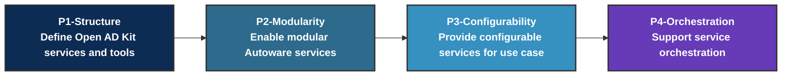

# Roadmap

```mermaid
graph LR
    A[P1-Structure<br/>Define Open AD Kit services and tools]
    B[P2-Modularity<br/>Enable modular Autoware services]
    C[P3-Configurability<br/>Provide configurable services for use case]
    D[P4-Orchestration<br/>Support service orchestration]

    A --> B --> C --> D;

    classDef p1 fill:#0d2c54,stroke:#333,stroke-width:2px,color:#fff,font-weight:bold;
    classDef p2 fill:#2d6a8b,stroke:#333,stroke-width:2px,color:#fff,font-weight:bold;
    classDef p3 fill:#3690c0,stroke:#333,stroke-width:2px,color:#fff,font-weight:bold;
    classDef p4 fill:#673ab7,stroke:#333,stroke-width:2px,color:#fff,font-weight:bold;

    class A p1;
    class B p2;
    class C p3;
    class D p4;
```
