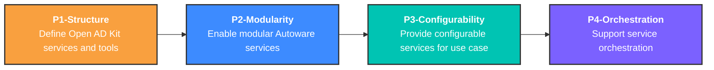

# Roadmap

```mermaid
graph LR
    A[<strong>P1-Structure</strong><br/>Define Open AD Kit services and tools]
    B[<strong>P2-Modularity</strong><br/>Enable modular Autoware services]
    C[<strong>P3-Configurability</strong><br/>Provide configurable services for use case]
    D[<strong>P4-Orchestration</strong><br/>Support service orchestration]

    A --> B --> C --> D;

    style A fill:#f9a03f,stroke:#333,stroke-width:2px,color:#fff;
    style B fill:#3d8bff,stroke:#333,stroke-width:2px,color:#fff;
    style C fill:#00c4b3,stroke:#333,stroke-width:2px,color:#fff;
    style D fill:#7b61ff,stroke:#333,stroke-width:2px,color:#fff;
```
