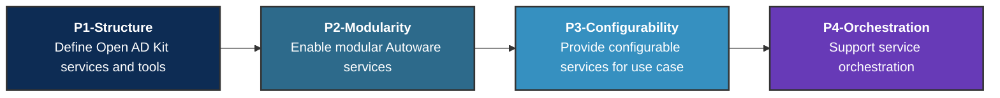

# Roadmap

```mermaid
graph LR
    A["<strong>P1-Structure</strong><br/>Define Open AD Kit services and tools"]
    B["<strong>P2-Modularity</strong><br/>Enable modular Autoware services"]
    C["<strong>P3-Configurability</strong><br/>Provide configurable services for use case"]
    D["<strong>P4-Orchestration</strong><br/>Support service orchestration"]

    A --> B --> C --> D;

    style A fill:#0d2c54,stroke:#333,stroke-width:2px,color:#fff;
    style B fill:#2d6a8b,stroke:#333,stroke-width:2px,color:#fff;
    style C fill:#3690c0,stroke:#333,stroke-width:2px,color:#fff;
    style D fill:#673ab7,stroke:#333,stroke-width:2px,color:#fff;
```
